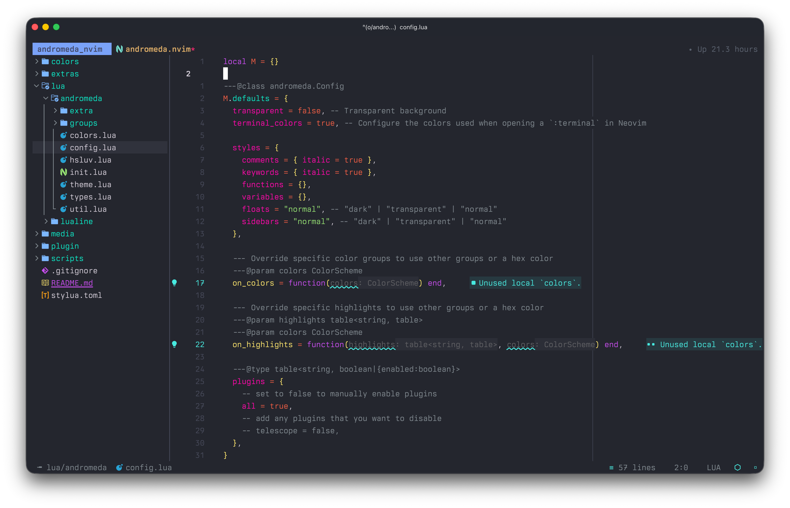

# 🌌 Andromeda.nvim

A dark, vibrant Neovim colorscheme inspired by the [Andromeda Theme for VS Code](https://github.com/EliverLara/Andromeda).



## ✨ Features

- 🎨 **Beautiful color palette** - Carefully crafted colors with cyan and magenta accents
- ⚡ **Fast** - Zero dependencies, direct highlight setting with `vim.api.nvim_set_hl()`
- 🔌 **Extensive plugin support** - 30+ popular Neovim plugins supported out of the box
- 🌳 **Full Treesitter support** - Comprehensive syntax highlighting with Treesitter
- 💻 **Terminal integration** - Works in Neovim terminal and external terminals (Alacritty, Kitty, Ghostty)
- ⚙️ **Highly customizable** - Customize colors, styles, and plugin integrations
- 📦 **Well organized** - Clean, modular architecture for easy maintenance

## 📦 Installation

### [lazy.nvim](https://github.com/folke/lazy.nvim)

```lua
{
  "idr4n/andromeda.nvim",
  lazy = false,
  priority = 1000,
  config = function()
    vim.cmd("colorscheme andromeda")
  end,
}
```

### [packer.nvim](https://github.com/wbthomason/packer.nvim)

```lua
use {
  "idr4n/andromeda.nvim",
  config = function()
    vim.cmd("colorscheme andromeda")
  end
}
```

### [vim-plug](https://github.com/junegunn/vim-plug)

```vim
Plug 'idr4n/andromeda.nvim'
```

Then in your `init.vim` or `init.lua`:

```vim
colorscheme andromeda
```

## 🚀 Usage

### Basic Setup

```lua
-- Simply activate the colorscheme
vim.cmd("colorscheme andromeda")
```

### Advanced Configuration

```lua
require("andromeda").setup({
  transparent = false,        -- Disable background color
  terminal_colors = true,     -- Configure terminal colors
  
  styles = {
    comments = { italic = true },
    keywords = { italic = true },
    functions = {},
    variables = {},
    floats = "normal",          -- "dark" | "transparent" | "normal"
    sidebars = "normal",        -- "dark" | "transparent" | "normal"
  },
  
  plugins = {
    all = true,               -- Enable all plugin integrations
    -- Selectively disable plugins:
    -- telescope = false,
    -- neo_tree = false,
  },
  
  -- Override specific colors
  on_colors = function(colors)
    colors.cyan = "#00d5c6"   -- Adjust cyan
  end,
  
  -- Override specific highlights
  on_highlights = function(highlights, colors)
    highlights.Comment = { fg = colors.fg_gutter, italic = true }
  end,
})

vim.cmd("colorscheme andromeda")
```

## 🎨 Color Palette

| Color | Hex | Usage |
|-------|-----|-------|
| Background | `#23262e` | Main background |
| Foreground | `#d5ced9` | Normal text |
| Cyan | `#00e8c6` | Primary accent, identifiers |
| Pink | `#ff00aa` | Secondary accent, properties |
| Purple | `#c74ded` | Keywords, types |
| Orange | `#f39c12` | Numbers |
| Yellow | `#ffe66d` | Functions |
| Magenta | `#f92672` | Tags, special |
| Blue | `#7cb7ff` | Strings (regex) |
| Red | `#ee5d43` | Errors, booleans |
| Green | `#96e072` | Strings |

## 🔌 Supported Plugins

<details>
<summary>Click to expand (30+ plugins)</summary>

### Completion & LSP
- [nvim-cmp](https://github.com/hrsh7th/nvim-cmp)
- [blink.cmp](https://github.com/Saghen/blink.cmp)
- LSP semantic tokens & kinds

### File Explorers
- [neo-tree.nvim](https://github.com/nvim-neo-tree/neo-tree.nvim)
- [nvim-tree.lua](https://github.com/nvim-tree/nvim-tree.lua)
- [netrw](https://neovim.io/doc/user/pi_netrw.html)

### Fuzzy Finders
- [telescope.nvim](https://github.com/nvim-telescope/telescope.nvim)
- [mini.pick](https://github.com/echasnovski/mini.pick)
- [snacks.picker](https://github.com/folke/snacks.nvim)

### Git
- [gitsigns.nvim](https://github.com/lewis6991/gitsigns.nvim)
- [vim-gitgutter](https://github.com/airblade/vim-gitgutter)
- [vim-fugitive](https://github.com/tpope/vim-fugitive)
- [vim-signify](https://github.com/mhinz/vim-signify)

### UI Enhancements
- [lualine.nvim](https://github.com/nvim-lualine/lualine.nvim)
- [bufferline.nvim](https://github.com/akinsho/bufferline.nvim)
- [mini.tabline](https://github.com/echasnovski/mini.tabline)
- [noice.nvim](https://github.com/folke/noice.nvim)
- [nvim-notify](https://github.com/rcarriga/nvim-notify)
- [which-key.nvim](https://github.com/folke/which-key.nvim)
- [mini.icons](https://github.com/echasnovski/mini.icons)

### Navigation & Editing
- [flash.nvim](https://github.com/folke/flash.nvim)
- [harpoon](https://github.com/ThePrimeagen/harpoon)
- [vim-illuminate](https://github.com/RRethy/vim-illuminate)
- [glance.nvim](https://github.com/dnlhc/glance.nvim)

### Indentation & Formatting
- [indent-blankline.nvim](https://github.com/lukas-reineke/indent-blankline.nvim)
- [snacks.indent](https://github.com/folke/snacks.nvim)
- [visual-whitespace.nvim](https://github.com/mcauley-penney/visual-whitespace.nvim)

### Syntax & Treesitter
- [nvim-treesitter](https://github.com/nvim-treesitter/nvim-treesitter)
- [nvim-treesitter-context](https://github.com/nvim-treesitter/nvim-treesitter-context)
- [rainbow-delimiters.nvim](https://github.com/HiPhish/rainbow-delimiters.nvim)

### Package Management
- [lazy.nvim](https://github.com/folke/lazy.nvim)
- [mason.nvim](https://github.com/williamboman/mason.nvim)

### Markdown
- [render-markdown.nvim](https://github.com/MeanderingProgrammer/render-markdown.nvim)

</details>

## 💻 Lualine Integration

```lua
require("lualine").setup({
  options = {
    theme = "andromeda",
  },
})
```

## 🖥️ Terminal Themes

Terminal theme files are provided in the `extras` folder, and have been generated via:

```bash
# Run from plugin root directory
./scripts/build_extras
```

## ⚙️ Configuration Options

### Styles

Customize syntax highlighting styles:

```lua
require("andromeda").setup({
  styles = {
    comments = { italic = true },
    keywords = { italic = true },
    functions = { bold = true },
    variables = {},
  },
})
```

### Transparency

```lua
require("andromeda").setup({
  transparent = true,  -- Transparent background
  styles = {
    sidebars = "transparent",  -- Transparent sidebars
    floats = "transparent",    -- Transparent floating windows
  },
})
```

### Plugin Control

```lua
require("andromeda").setup({
  plugins = {
    all = false,            -- Disable all plugins
    telescope = true,       -- Enable specific plugins
    ["neo-tree"] = true,
  },
})
```

### Custom Colors

```lua
require("andromeda").setup({
  on_colors = function(colors)
    colors.cyan = "#00ffff"       -- Brighter cyan
    colors.bg = "#1a1d23"         -- Darker background
    colors.error = "#ff0000"      -- Custom error color
  end,
})
```

### Custom Highlights

```lua
require("andromeda").setup({
  on_highlights = function(hl, colors)
    hl["@function"] = { fg = colors.blue, bold = true }
    hl.Comment = { fg = colors.fg_gutter, italic = true }
    hl.CursorLine = { bg = colors.bg_highlight }
  end,
})
```

## 🎯 Design Philosophy

Andromeda.nvim is designed with these principles:

- **Performance**: No runtime dependencies, fast loading
- **Consistency**: Cohesive color usage across all plugins
- **Maintainability**: Clean, modular code structure
- **Flexibility**: Extensive customization options
- **Completeness**: Comprehensive plugin and syntax support
- **No dependencies** - No colorbuddy.nvim or similar dependencies
- **Terminal themes** - provides configs for external terminals
- **customization** - Hooks for colors and highlights
- **Modern structure** - Based on tokyonight.nvim architecture

## 🤝 Contributing

Contributions are welcome! Please feel free to submit issues or pull requests.

## Similar Projects


## 🙄 Other Themes by Me

Take a look at my other theme: [idr4n/github-monochrome.nvim: A set of monochromatic light and dark color schemes for Neovim.](https://github.com/idr4n/github-monochrome.nvim)

## 📄 License

MIT

## 🙏 Credits

- Original [Andromeda Theme for VS Code](https://github.com/EliverLara/Andromeda) by EliverLara
- Similar project [nobbmaestro/nvim-andromeda](https://github.com/nobbmaestro/nvim-andromeda)
- Zed's VS Code port [ChocolateNao/andromeda-zed](https://github.com/ChocolateNao/andromeda-zed)
- Architecture inspired by [tokyonight.nvim](https://github.com/folke/tokyonight.nvim)
